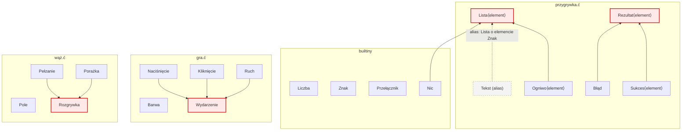
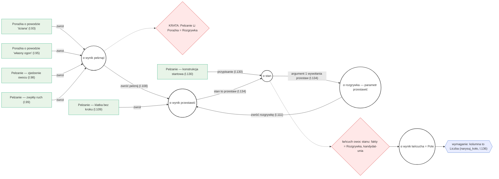
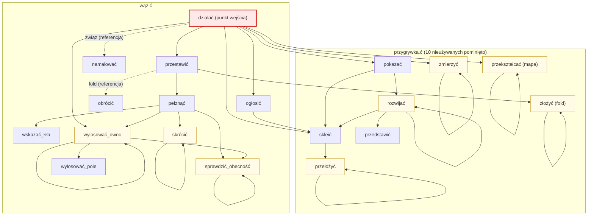

# Dwa grafy węża — materiał na slajd „Maszyna"

Oba grafy dotyczą `manual_test/wąż.ć` (z włączonym `gra.ć` i przygrywką).

Gotowe rendery obok: `krata.svg`/`krata.png` i `granice.svg`/`granice.png` (wygenerowane mermaid-cli — do wstawienia w slajdy
bez żadnych wtyczek). Podgląd Mermaida w VS Code wymaga rozszerzenia
„Markdown Preview Mermaid Support" (Matt Bierner); identyfikatory
węzłów poniżej są ASCII-owe (etykiety w cudzysłowach niosą polskie
znaki), bo znaki diakrytyczne w ID i kropki w nienazwanych
podgrafach wywracają część rendererów.

## Graf 1: krata nominalna (graf członków unii) — „mapa świata"

Statyczna, zbudowana raz z deklaracji `albo`; strzałka = „jest
zadeklarowanym członkiem". Cykle zakazane. `⟨element⟩` oznacza parametr
typu (unie dziedziczą go po nazwach członków).

Węzły bez strzałek wychodzących (Pole, Barwa, Liczba, Znak, Przełącznik)
to typy poza wszelkimi uniami — ich join z czymkolwiek innym nie
istnieje. Jedyny węzeł w dwóch rodzinach: `Nic` (builtin ORAZ członek
Listy).

## Graf 2: graf granic — „sieć dróg tego programu" (wycinek: pętla stanu)

Dynamiczny, budowany z każdej linijki; `α` = zmienna typowa (węzeł),
krawędź = granica z poszlaką (linia + kontekst). Prostokąty = konkrety
(fakty-liście), podwójne kółka = zmienne typowe, romb = zapytanie do
KRATY (join), sześciokąt = wymaganie.

Dwie rzeczy do pokazania palcem:

1. **CYKL**: `α stan → α rozgrywka → α wynik przestawić → α stan`
   (argument wywołania + `zwróć rozgrywkę` + przypisanie wyniku).
   To nie patologia, tylko typowa pętla stanu gry — i powód, dla
   którego każdy wędrowiec grafu granic nosi zbiór odwiedzonych.
2. **Współpraca grafów**: różowe węzły to miejsca, gdzie solver pyta
   kratę — join czterech zwrotów pełznąć (Pełzanie ⊔ Porażka) oraz
   rozstrzygnięcie kandydata łańcucha `owoc stanu` (fakt-unia →
   odczyt pola wspólnego).

## Graf 3: graf wywołań — „w jakiej kolejności"

Krawędzie WYMIERZONE z solvera (`_wywoływane` na ciałach funkcji),
nie narysowane z pamięci. Ciągła strzałka = wywołanie wprost;
przerywana = referencja gerundialna (funkcja przekazana jako
wartość — `zwiąż namalowanie…`, fold `z obróceniem`). Żółte węzły
mają pętlę własną (samorekursja). Rendery: `wywolania.svg`/`.png`.

Tarjan na tym grafie daje dla węża **29 SCC — same singletony**
(każda żółta pętla to własny, jednofunkcyjny fixpoint). Kontrast
z repo: brainfuck.ć ma trzyfunkcyjną SCC `wykonać ↔ zapętlić ↔
obsłużyć` — tam sygnatury stabilizują się razem. Osiągalne od
`działać`: 19 z 29 funkcji (10 przygrywkowych nieużywanych
pominięto na rysunku).

Trzy grafy razem: **graf wywołań** decyduje *w jakiej kolejności*
(SCC + porządek topologiczny), **graf granic** niesie *co wiemy*
(376 α, 1391 granic dla węża), a **krata** rozstrzyga *czy to się
składa* (joiny, kandydaci).
